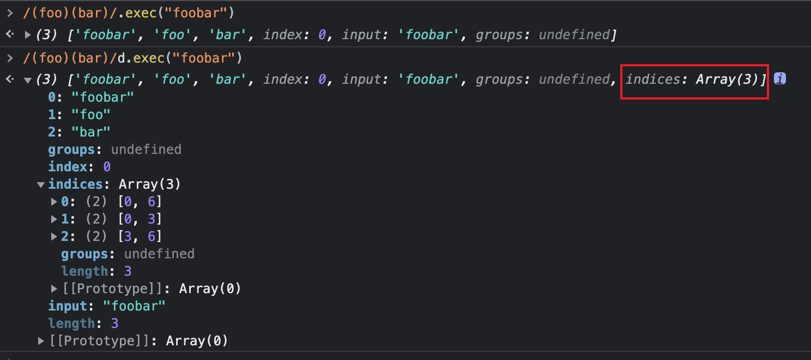
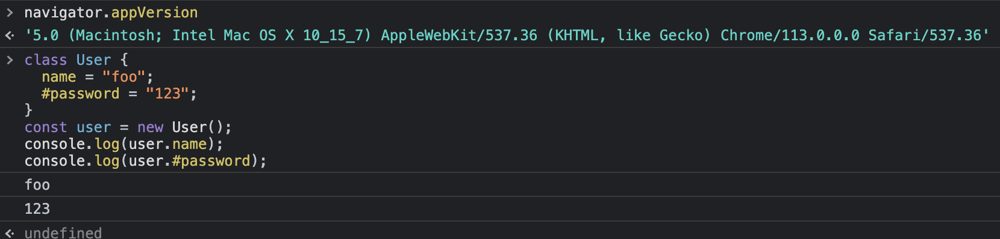
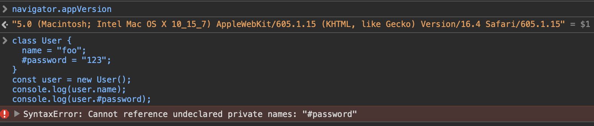

# ES2022 新特性

JavaScript 每年 6 月都会发布一些新特性，来回顾下 2022 年发布的新特性。可以到[TC39](https://github.com/tc39/proposals/blob/HEAD/finished-proposals.md)查看每年的提案。

## 1. Top-level await 顶层 await

以前想用`await`关键字需要在`async`函数中才可以，这样会多写一些不必要的代码。有了这个新特性后就能直接使用`await`了，不用再多写一层`async`函数。

```js
// 现在的写法
const data = await fetch("https://catfact.ninja/fact");
console.log(await data.json());

// 之前的写法
(async () => {
  const data = await fetch(url);
  console.log(data);
})();
```

## 2. `.at()`

`at(index)`是数组方法，参数是可以是正数和负数，当参数 `index < 0` 时则会访问  `index + array.length`  位置的元素。比如访问数组最后一个元素：

```js
// 现在可以用at()
const arr = [1, 3, 5];
console.log(arr.at(-1)); // 5

// 以前的写法
const arr = [1, 3, 5];
console.log(arr[arr.length - 1]); // 5
```

## 3. RegExp Match Indices 正则表达式匹配索引

如果  `d`  标志被使用，则  `RegExp.prototype.hasIndices`  的值是  `true`；否则是  `false`。`d`  标志表示正则表达式匹配的结果应该包含每个捕获组子字符串开始和结束的索引。

```js
/(foo)(bar)/.exec("foobar");
/(foo)(bar)/d.exec("foobar");
```



## 4. Class Fields

对 JavaScript 中`Class`（类）的增强。

### 4.1 Class Field Declarations 类的字段定义

以前给类(`Class`)定义字段需要写在`constructor`，现在写到类里就可以。

```js
// 现在的写法
class counter {
  count = 0;

  increment() {
    this.count++;
  }
}

// 之前的写法
class counter {
  constructor() {
    this.count = 0;
  }

  increment() {
    this.count++;
  }
}
```

### 4.2 Private Methods and Fields 私有字段和私有方法

私有字段和私有方法，以`#`作为前缀。只能在内部调用，外部调用会报错。

```js
class User {
  // 私有字段
  #password = "123";

  // 私有方法
  #privateMethod() {
    console.log("private");
  }
}
const user = new User();
console.log(user.#password);
// syntaxerror: Cannot reference undeclared private names: "#password22 (Version/16.4 Safari/605.1.15")
// Chrome/113.0.0.0 Safari/537.36 没报错，返回123
user.#privateMethod();
```




### 4.3 Static Fields and Static Methods 静态字段和静态方法

静态字段和静态方法, 用`static`关键字，通过类名直接访问。

```js
class Person {
  static name = "John Doe";

  static sayHello() {
    return "Hello, " + Person.name;
  }
}

const person = new Person();

console.log(Person.name); // "John Doe"
console.log(Person.sayHello()); // "Hello, John Doe"
```

### 4.4 Static Private Fields and Static Private Methods 静态私有字段和静态私有方法

```js
class MyClass {
  // 静态私有字段
  static #privateField = "Hello, world!";

  // 静态私有方法
  static #privateMethod() {
    return this.#privateField;
  }

  // 公有方法访问私有字段
  getPrivateField() {
    return MyClass.#privateMethod();
    // 或者
    // return this.constructor.#privateMethod();
  }
}

const myClass = new MyClass();
console.log(myClass.getPrivateField()); // "Hello, world!"
```

### 4.5 Class static Block 类静态块

静态代码块只运行一次，在类创建的时候。静态代码块中可以初始化静态属性。一个类中可以有多个静态代码块。

```js
class MyClass {
  static firstName = "John";
  static lastName = "Doe";

  static {
    console.log(`The full name is ${MyClass.firstName} ${MyClass.lastName}`);
  }
}
const myClass = new MyClass(); // The full name is John Doe
```

### 4.6 Ergonomic brand checks for private fields 用 in 操作符检查私有属性

我们可以使用 ES2022 的新功能，通过使用 in 运算符来检查一个对象是否具有特定的私有字段。

```js
class User {
  #name;

  hasName() {
    return #name in this;
  }
}

const user = new User();
console.log(user.hasName()); // true;
```

## 5. Object.hasOwn() Method

`Object.hasOwn()` 是一个静态方法，可用于检查对象中是否存在某个属性。如果指定的对象包含了该属性，则返回 true，如果该属性是继承的或不存在，则返回 false。该方法以对象作为第一个参数，要检查的属性作为第二个参数。

`Object.hasOwn` 是 `Object.prototype.hasOwnProperty` 方法的预期替代品。`Object.prototype.hasOwnProperty` 有一些缺点，如下：

```js
// 问题 1. `Object.create(null)` 创建的对象使用 `hasOwnProperty` 会抛出一个错。
const obj = Object.create(null);
obj.color = "green";
obj.age = 2;
// 对象不继承自 Object.prototype
// TypeError: obj.hasOwnProperty is not a function
console.log(obj.hasOwnProperty("color"));

// 问题 2. hasOwnProperty可以被重写
class Car {
  color = "green";
  age = 2;

  hasOwnProperty() {
    return false;
  }
}

const car = new Car();

console.log(car.hasOwnProperty("age")); // false
console.log(car.hasOwnProperty("name")); // false
```

Object.hasOwn

```js
const obj = Object.create(null);
obj.color = "green";
obj.age = 2;
obj.hasOwn = () => false;

console.log(Object.hasOwn(obj, "color")); // true
console.log(Object.hasOwn(obj, "name")); // false
```

## 6. Error Cause

有时，捕获错误并使用新的错误信息将其重新抛出是很有用的。在这种情况下，你应该将原始错误传递给新的 `Error` 的构造函数，如下所示：

```js
function userAction() {
  try {
    const res = 2 / 0;
  } catch (err) {
    throw new Error("New error message", { cause: err });
  }
}

try {
  userAction();
} catch (err) {
  console.log(err);
  // 现在我们可以通过err.cause看出报错的原因了
  console.log(`Cause by: ${err.cause}`);
}
```

总结：

我们已经看到了 ES13（ES2022）为 JavaScript 带来的最新功能。利用它们来提高作为开发人员的生产力，并以更简洁明了的方式编写更清晰的代码。

参考

- [github](https://github.com/tc39/proposals/blob/HEAD/finished-proposals.md)
- [MDN](https://developer.mozilla.org/zh-CN/docs/Web/JavaScript/Reference/Global_Objects/Object/hasOwnProperty)
- [dev.to](https://dev.to/syncfusion/7-features-of-es2022-you-should-know-17jm)
- [codingbeautydev](https://codingbeautydev.com/blog/es13-javascript-features/)
- [bard](https://bard.google.com/?hl=en)
