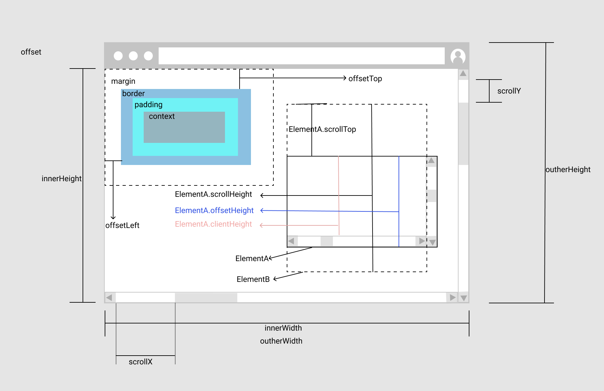

# JavaScript 中的各种距离

window 里的各种距离

## 距离相关的属性

window 对象和 HTML 元素中都有和距离相关的属性

```JavaScript
Object.getOwnPropertyNames(window).filter((prop) => /height|width|offset|inner|scroll/i.test(prop))
// ["SVGFEOffsetElement", "scrollbars", "innerWidth", "innerHeight", "scrollX", "pageXOffset", "scrollY", "pageYOffset", "outerHeight", "outerWidth", "onscroll", "scroll", "scrollBy", "scrollTo"]

var arr = []
for(k in document.body){
    arr.push(k)
}
arr.filter(prop => /height|offset|inner|scroll/i.test(prop))
// ["onscroll", "offsetParent", "offsetTop", "offsetLeft", "offsetWidth", "offsetHeight", "innerText", "innerHTML", "scrollTop", "scrollLeft", "scrollWidth", "scrollHeight", "clientWidth", "clientHeight", "scroll", "scrollBy", "scrollIntoView", "scrollIntoViewIfNeeded", "scrollTo"]
```

**window**

- innerWidth：窗口宽度(包含滚动条)
- innerHeight：窗口高度(包含滚动条)
- scrollX(pageXOffset 是 scrollX 的别名)：水平滚动条滚动距离
- scrollY(pageYOffset 是 scrollY 的别名)：垂直滚动条滚动距离
- outerHeight：整个浏览器的高度
- outerWidth：整个浏览器的宽度

**Element**

- offsetTop：元素相对于其 offsetParent 上边界的距离
- offsetLeft：元素左上角相对于其 offsetParent 左边界偏移的距离
- scrollTop：一个垂直方向有滚动条的元素，垂直方向顶部被卷起来的高度
- scrollLeft：一个水平方向有滚动条的元素，水平方向左边被卷起来的宽度
- scrollWidth：一个有滚动条元素，可见区宽度加不可见区宽度
- scrolHeight：一个有滚动条的元素，可见区高度加不可见区高度
- clientWidth：不包含滚动条和 border 宽度，等价 css(width)+css(padding)-width(scrollbar)
- clientHeight：不包含滚动条和 border 高度，等价 css(height)+css(padding)-heihgt(scrollbar)
- offsetWidth：水平方向 border 宽度+水平方向 padding+水平滚动条宽度
- offsetHeight：垂直方向 border 宽+垂直方向 padding+垂直方向滚动条高度

```!
1. offsetParent:元素最近的定位父元素或body,table,th,td
2. 一般垂直滚动条宽17px，水平滚动条高17px
3. 滚动条会占据元素的宽度或高度
4. 还有两个有用的方法：Element.getClientRects()和Element.getBoundingClientRect()
```



- [HEMLElement.offsetLeft](https://developer.mozilla.org/zh-CN/docs/Web/API/HTMLElement/offsetLeft)
