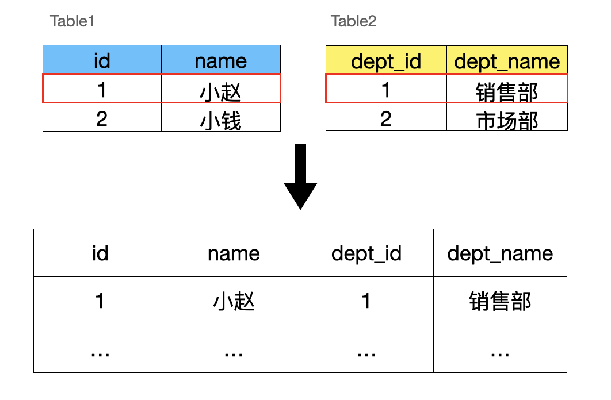

# SQL 连接查询

## 什么是连接查询

SQL 连接可以看作把多个表的列连成一行。这样就可以一次性查询出多个表的数据了。如图：



先创建员工表和部门表，并添加数据。

```sql
-- 创建员工表
CREATE TABLE Employee (
  EmployeeID INT PRIMARY KEY,
  Name VARCHAR(50),
  DepartmentID INT,
  Salary DECIMAL(10, 2),
  HireDate DATE
);
-- 向员工表插入数据
INSERT INTO Employee (EmployeeID, Name, DepartmentID, Salary, HireDate)
VALUES
  (1, '小赵', 1, 5000.00, '2022-01-15'),
  (2, '小钱', 2, 4000.00, '2022-03-10'),
  (3, '小孙', NULL, 3500.00, '2022-02-20');
-- 创建部门表
CREATE TABLE Department (
  DepartmentID INT PRIMARY KEY,
  DepartmentName VARCHAR(50)
);
-- 向部门表插入数据
INSERT INTO Department (DepartmentID, DepartmentName)
VALUES
  (1, '销售部'),
  (2, '市场部'),
  (3, '财务部');
```

查询员工表

```sql
SELECT * FROM Employee;
+------------+--------+--------------+---------+------------+
| EmployeeID | Name   | DepartmentID | Salary  | HireDate   |
+------------+--------+--------------+---------+------------+
|          1 | 小赵   |            1 | 5000.00 | 2022-01-15 |
|          2 | 小钱   |            2 | 4000.00 | 2022-03-10 |
|          3 | 小孙   |         NULL | 3500.00 | 2022-02-20 |
+------------+--------+--------------+---------+------------+
```

查询部门表

```sql
SELECT * FROM Department;
+--------------+----------------+
| DepartmentID | DepartmentName |
+--------------+----------------+
|            1 | 销售部         |
|            2 | 市场部         |
|            3 | 财务部         |
+--------------+----------------+
```

## 交叉连接

两个表没有连接条件时返回的结果为两个表的笛卡尔积（`Cartesian product`），即将第一个表的每一行与第二个表的每一行进行组合。结果集的行数为两个表的行数的乘积。有时也叫交叉连接（`CROSS JOIN`），注意交叉连接是没有连接条件的。

```sql
SELECT * FROM Employee, Department ORDER BY EmployeeID;
-- 也可以像下面这样写
SELECT * FROM Employee CROSS JOIN Department ORDER BY EmployeeID;
```

查询出来的结果

```sql
+------------+--------+--------------+---------+------------+--------------+----------------+
| EmployeeID | Name   | DepartmentID | Salary  | HireDate   | DepartmentID | DepartmentName |
+------------+--------+--------------+---------+------------+--------------+----------------+
|          1 | 小赵   |            1 | 5000.00 | 2022-01-15 |            1 | 销售部         |
|          1 | 小赵   |            1 | 5000.00 | 2022-01-15 |            2 | 市场部         |
|          1 | 小赵   |            1 | 5000.00 | 2022-01-15 |            3 | 财务部         |
|          2 | 小钱   |            2 | 4000.00 | 2022-03-10 |            1 | 销售部         |
|          2 | 小钱   |            2 | 4000.00 | 2022-03-10 |            2 | 市场部         |
|          2 | 小钱   |            2 | 4000.00 | 2022-03-10 |            3 | 财务部         |
|          3 | 小孙   |         NULL | 3500.00 | 2022-02-20 |            1 | 销售部         |
|          3 | 小孙   |         NULL | 3500.00 | 2022-02-20 |            2 | 市场部         |
|          3 | 小孙   |         NULL | 3500.00 | 2022-02-20 |            3 | 财务部         |
+------------+--------+--------------+---------+------------+--------------+----------------+
9 rows in set (0.00 sec)
```

可以看到员工表中每条数据都和部门表中每条数据组合了，一共 9 条数据。

## 内连接

内连接（`INNER JOIN`）只返回连接条件为真的那些行，可以看到前面交叉连接没有连接条件，内连接有了连接条件。

现在的员工表里只有员工的部门 id，现在通过内连接把员工的部门名称查询出来。

```sql
SELECT * FROM Employee, Department WHERE Employee.DepartmentID = Department.DepartmentID;
-- 也可以像下面这样写
SELECT * FROM Employee INNER JOIN Department ON Employee.DepartmentID = Department.DepartmentID;
```

返回结果如下

```sql
+------------+--------+--------------+---------+------------+--------------+----------------+
| EmployeeID | Name   | DepartmentID | Salary  | HireDate   | DepartmentID | DepartmentName |
+------------+--------+--------------+---------+------------+--------------+----------------+
|          1 | 小赵   |            1 | 5000.00 | 2022-01-15 |            1 | 销售部         |
|          2 | 小钱   |            2 | 4000.00 | 2022-03-10 |            2 | 市场部         |
+------------+--------+--------------+---------+------------+--------------+----------------+
```

可以看到加了连接条件之后，相当于用连接条件从交叉连接的结果里过滤掉了不满足条件的数据。

内连接还可以看成取两个表的交集。

## 外连接

外连接分为左外连接（`LEFT OUTER JOIN`）、右外连接（`RIGHT OUTER JOIN`）和完全外连接（`FULL OUTER JOIN`）三种类型，其中`OUTER`可以省略。

1.  左外连接：返回左表中的所有行以及右表中与左表匹配的行。如果右表中没有匹配的行，则以 NULL 值填充右表的列。
2.  右外连接：返回右表中的所有行以及左表中与右表匹配的行。如果左表中没有匹配的行，则以 NULL 值填充左表的列。
3.  完全外连接：返回两个表中的所有行，如果在另一个表中没有匹配的行，则以 NULL 值填充相应的列。

### 左外连接

用左外连接查询员工及其部门名称

```sql
SELECT * FROM Employee LEFT JOIN Department ON Employee.DepartmentID = Department.DepartmentID;
```

查询结果如下

```sql
+------------+--------+--------------+---------+------------+--------------+----------------+
| EmployeeID | Name   | DepartmentID | Salary  | HireDate   | DepartmentID | DepartmentName |
+------------+--------+--------------+---------+------------+--------------+----------------+
|          1 | 小赵   |            1 | 5000.00 | 2022-01-15 |            1 | 销售部         |
|          2 | 小钱   |            2 | 4000.00 | 2022-03-10 |            2 | 市场部         |
|          3 | 小孙   |         NULL | 3500.00 | 2022-02-20 |         NULL | NULL           |
+------------+--------+--------------+---------+------------+--------------+----------------+
```

可以看到左连接会返回`LEFT JOIN`关键词左边表里所有的行。

可以理解为返回的结果集是左边的表所有行，根据连接条件“连接”上右边表里相应的列，不满足“连接”条件的填入 NULL。

### 右外连接

左外连接和右外连接可以相互转换。

比如把上面的做连接修改一下，LEFT JOIN 改为 RIGHT JOIN，再把两个表位置换一下。会得到一样的结果。

```sql
SELECT * FROM Department RIGHT JOIN Employee ON Employee.DepartmentID = Department.DepartmentID;
```

### 完全外连接

```sql
SELECT * FROM Employee FULL OUTER JOIN Department ON Employee.DepartmentID = Department.DepartmentID;,
```

查询结果

2023.5.28 测试时 mysql(ver 8.0.31)不支持完全外连接，postgresql(ver 15.2)支持。

```sql
employeeid | name | departmentid | salary  |  hiredate  | departmentid | departmentname 
------------+------+--------------+---------+------------+--------------+----------------
          1 | 小赵 |            1 | 5000.00 | 2022-01-15 |            1 | 销售部
          2 | 小钱 |            2 | 4000.00 | 2022-03-10 |            2 | 市场部
          3 | 小孙 |         NULL | 3500.00 | 2022-02-20 |         NULL | NULL
       NULL | NULL |         NULL |    NULL |       NULL |            3 | 财务部
```

满足连接条件的数据连接之后出现在结果集中。不满足连接条件的数据也会出现在结果集中，只不过不满足连接条件的列是`NULL`。可以看到完全连接返回了两个表包含的所有行。

## 自连接

自连接（`Self-Join`）将同一个表作为两个不同的实例进行连接操作。自连接用于在单个表中建立表内的关联关系，使得您可以比较或组合同一表中的不同行。

比如查询员工表中薪水高于小钱薪水的人。

```sql
SELECT e2.Name FROM Employee e1, Employee e2 WHERE e1.Name = "小钱" AND e2.Salary > e1.Salary;
```

查询结果

```sql
+--------+
| Name   |
+--------+
| 小赵   |
+--------+
```

可以看到自连接可以用于比较同一个表里的数据。

看到有人绘制了图，可以辅助理解

- [sql join1](https://twitter.com/akshay_pachaar/status/1692514645792493964)
- [sql join2](https://twitter.com/DataScienceDojo/status/1708618294775738767)

总结：

- 用了 JOIN 子句后仍然可以使用 where 条件。
