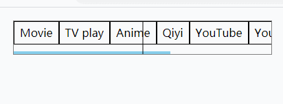
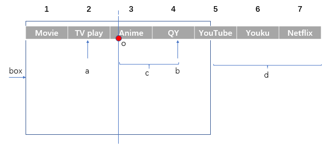
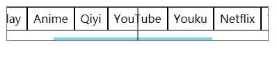

# 滚动居中菜单

移动端常见的顶部菜单，让我们来实现一下吧，效果图在下面。

## html 结构

```html
<ul class="tab-container" id="tab-container">
  <li>Movie</li>
  <li>TV play</li>
  <li>Anime</li>
  <li>Qiyi</li>
  <li>YouTube</li>
  <li>Youku</li>
  <li>Netflix</li>
  <li>Video</li>
  <li>Cartoon</li>
</ul>
```

## JavaScript

```JavaScript
const tabContainer = document.getElementById("tab-container");
      const tabWidth = tabContainer.offsetWidth;

      tabContainer.addEventListener("click", function (e) {
        let tabItem = e.target;
        // 计算当前点中的tabItem的中心到tab左顶点的长度（自己长度的一半加上它前面所有tabItem的长度）
        let leftWidth = tabItem.offsetWidth / 2;
        while (tabItem.previousElementSibling) {
          tabItem = tabItem.previousElementSibling;
          leftWidth += tabItem.offsetWidth;
        }

        if (leftWidth <= tabWidth / 2) {
          tabContainer.scrollLeft = 0;
        } else {
        // 注意这里用clientWidth而不是offsetWidth
          const maxDistance = tabContainer.scrollWidth - tabContainer.clientWidth;
          const distance = leftWidth - tabWidth / 2;
          // 左移有最大距离限制
          tabContainer.scrollLeft = Math.min(maxDistance, distance);
        }
      });
```

到现在为止基本完成了，如下图。


(图片中间加了辅助线，方便观看)

如图，红点位置是 box 的一半。点击红点左边的 tabItem，tab 只需要左对齐，即设置 scrolLeft 为 0。点击红点右边的 tabItem，tab 需要向左移动，移动的距离(例如点第四个 tabItem，距离是 c 段)等于当前点击的 tabItem 的中心位置到 box 左边位置的距离减去 box 一半的长度。同时不能大于如图 d 的长度，不然右边会空出来。

## 加动画效果

现在来加上动画效果。使用`requestAnimationFrame`。


```JavaScript
// 部分代码
if (leftWidth <= tabWidth / 2) {
    const oldScrollLeft = tabContainer.scrollLeft;
    let v = 0;
    // 这时需要移动tab与box左对齐
    if (oldScrollLeft > 0) {
      const slide = function () {
        v += vx;
        let d = oldScrollLeft - v;
        // 小于0时取0
        tabContainer.scrollLeft = Math.max(d, 0);
        if (tabContainer.scrollLeft > 0) {
          requestAnimationFrame(slide);
        }
      };
      requestAnimationFrame(slide);
    }
  }
```

[GitHub 代码](https://github.com/lfl976/code/blob/main/scrollTab/scrollTab.html)
